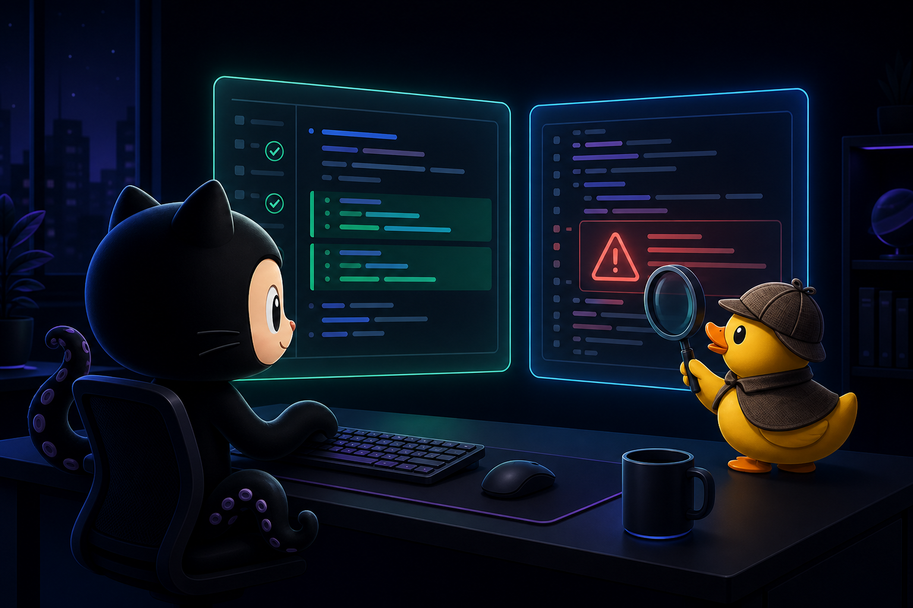

# Copilot Rubber Duck CLI

CLI to automate VS Code 1.135's new Rubber Duck dual-model reviews via the Agent Host Protocol (AHP).

## What is Rubber Duck?

VS Code 1.135 (released August 26, 2026) introduced **Rubber Duck** — an experimental feature that gets a second opinion from a complementary model on your agent's work. It surfaces missed details, edge cases, and subtle bugs that a single model might overlook.

This CLI brings that capability to your terminal and CI pipelines.

## How it works

```
┌─────────────┐     ┌──────────────────┐     ┌─────────────────┐
│  Your Code  │────▶│  Primary Model   │────▶│   Findings A    │
│             │     │  (e.g. GPT-5.5)  │     │                 │
└─────────────┘     └──────────────────┘     └────────┬────────┘
       │                                              │
       │            ┌──────────────────┐              │  Compare
       └───────────▶│  Rubber Duck     │──────────────┤
                    │  (e.g. Claude)   │              ▼
                    └──────────────────┘     ┌─────────────────┐
                                            │  Merged Report  │
                                            │  + Exclusives   │
                                            └─────────────────┘
```

Two models review the same code independently. The CLI compares their findings and highlights what the "rubber duck" caught that the primary missed.

## Install

```bash
git clone https://github.com/jrubiosainz/copilot-rubber-duck-cli.git
cd copilot-rubber-duck-cli
chmod +x bin/cli.js
```

## Usage

```bash
# Review a single file
rubber-duck review src/auth.js --focus security

# Side-by-side comparison (show only disagreements)
rubber-duck compare lib/parser.ts --diff

# Batch review with markdown report
rubber-duck batch "src/**/*.js" --format markdown -o report.md

# List available model pairs
rubber-duck models

# Custom model pairing
rubber-duck review app.py --primary gpt-5.5 --secondary gemini-2.5-pro
```

## Options

| Flag | Description | Default |
|------|-------------|---------|
| `--host <url>` | AHP WebSocket endpoint | `ws://localhost:4040` |
| `--primary <model>` | Primary reviewer model | From AHP session |
| `--secondary <model>` | Rubber Duck model | From AHP session |
| `--focus <area>` | `bugs`, `perf`, `security`, `edge-cases`, `all` | `all` |
| `--format <fmt>` | `terminal`, `markdown`, `json` | `terminal` |
| `--diff` | Show only disagreements | `false` |
| `-o <file>` | Write report to file | stdout |

## Focus areas

- **bugs** — Logical errors, null risks, incorrect control flow
- **perf** — Unnecessary allocations, O(n²) loops, missing caching
- **security** — Injection, path traversal, prototype pollution, secrets
- **edge-cases** — Empty inputs, concurrency, overflow, Unicode, timezones

## Demo mode

When no AHP host is available, the CLI runs in demo mode with simulated dual-model output — useful for exploring the interface and integrating into scripts before connecting to a live agent host.

## Why dual-model review matters

Single-model code review has blind spots. Each model family has different training data and reasoning patterns. By pairing two complementary models:

- GPT excels at pattern matching and common bug detection
- Claude tends to catch subtle logical issues and edge cases
- Gemini brings strong reasoning about type systems and concurrency

The Rubber Duck approach is not about which model is "better" — it is about coverage. Two independent reviewers catch more than one.

## Requirements

- Node.js 20+
- VS Code 1.135+ with Agent Host enabled (for live mode)
- Optional: `ws` npm package for WebSocket connectivity

## License

MIT
